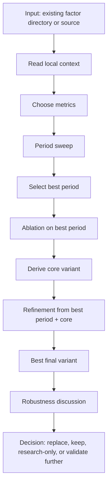

# Factor Optimize

[简体中文](README.md) | **English**

> One-line positioning: optimize an existing stock or futures factor through period sweeps, component ablations, core-variant refinement, and a final keep-or-replace decision.


## What This Is

`skill-factor-optimize` is a factor optimization workflow skill for quantitative research agents. It does not mine new factors from scratch. Instead, it takes one existing factor and reuses the local project's data, evaluation engine, metrics, assumptions, and reporting conventions to run period sweeps, select the best period, perform component ablations, derive a core variant, test refinements, and decide whether to replace the original factor.

It is designed for both stock and futures factors. Metrics are not hard-coded: use user-specified metrics first, infer project metrics second, and fall back to common factor metrics such as IC, ICIR, PnL, Sharpe, turnover, coverage, group returns, or long/short decomposition when necessary.

The skill is Chinese-first. Generated Markdown summaries, final reports, and chat responses should be primarily in Chinese unless the project or user requests otherwise. It also requires the agent to expose enough evidence in the chat response, not only write files, including key metric comparisons, robustness discussion, and the final recommendation.

## Workflow

The skill turns one existing factor into a traceable optimization chain:



The agent should reuse the local evaluation environment and avoid brute-force Cartesian searches across every period combination.

## Generated Artifacts

Artifacts are written under the factor directory:

```text
<factor_dir>/
└── optimize_tests/
    ├── 00_manifest.json
    ├── period_sweep/
    │   ├── period_sweep_metrics.csv
    │   └── period_sweep_summary.md
    ├── ablation/
    │   ├── ablation_metrics.csv
    │   ├── core_variant_daily_analyze.png
    │   └── ablation_summary.md
    ├── refinement/
    │   ├── refinement_metrics.csv
    │   ├── best_variant_daily_analyze.png
    │   └── refinement_summary.md
    └── optimize_report.md
```

| Artifact | Purpose |
| --- | --- |
| `00_manifest.json` | Records data, engine, metrics, factor name, and experiment state |
| `period_sweep_metrics.csv` | All tested periods or period sets |
| `period_sweep_summary.md` | Original period, tested range, robust region, and selected best period |
| `ablation_metrics.csv` | Component removal/simplification variants at the best period |
| `ablation_summary.md` | Core/helpful/risk-control/cosmetic/harmful component classification |
| `refinement_metrics.csv` | Enhancement attempts from `best period + core` |
| `refinement_summary.md` | Refinement results and best final variant |
| `optimize_report.md` | Full linked report and final decision |

## Chat Response Requirement

The final chat response must not only point to files. It should include the evaluation setup, period sweep conclusion, ablation conclusion, refinement conclusion, a compact metric comparison, robustness discussion, and the final recommendation.

## Quick Start

```bash
cp -r skill-factor-optimize ~/.codex/skills/factor-optimize
```

Example prompts:

```text
Use $factor-optimize to optimize this factor directory. Use the project's existing IC/ICIR and turnover metrics.
```

```text
Use $factor-optimize to sweep the key periods, run ablations on the best period, and tell me whether the refined version should replace the original factor.
```

## Repository Layout

```text
skill-factor-optimize/
├── SKILL.md
├── README.md
├── README.en.md
├── LICENSE
├── agents/
│   └── openai.yaml
├── references/
│   ├── report-format.md
│   └── source-boundary.md
└── scripts/
    └── init_optimize_folder.py
```

## Core Constraints

| Constraint | Description |
| --- | --- |
| Reuse local engine | Prefer existing data, labels, evaluation functions, backtest scripts, and report formats |
| Do not hard-code metrics | Use user metrics first, infer from context second, and document fallback choices |
| Sweep before ablation | Run ablations only after fixing the selected best period |
| Control search space | For multi-period factors, test core parameters rather than exploding Cartesian products |
| Refine from core | Start refinement from `best period + core components` |
| Do not auto-overwrite source | Update canonical factor code only after explicit user confirmation |
| Informative chat response | Final chat response must include key metrics, core components, best variant, and robustness judgment |
| Discuss robustness | Cover parameter, time/market, cost, coverage, side decomposition, and search-bias risks |

## Disclaimer

This repository is for quantitative research methodology and agent workflow organization only. It does not include market data, factor data, or verified performance claims, and does not constitute investment advice, trading signals, or return guarantees.

## License

This project is licensed under the GNU General Public License v3.0. See [LICENSE](LICENSE).
