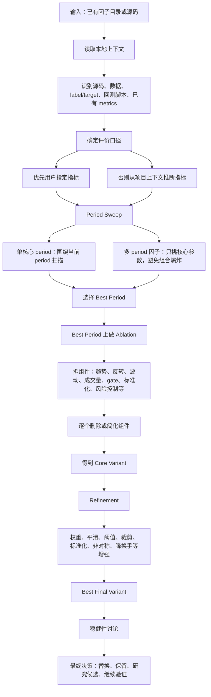

# Factor Optimize

**简体中文** | [English](README.en.md)

> 一句话定位：对已有股票或期货因子做参数扫描、组件消融和核心版本增强，最后给出是否替换原因子的研究结论。


## 这是什么

`skill-factor-optimize` 是一个面向量化研究 Agent 的因子优化工作流 skill。它不从零挖因子，而是围绕一个已有因子，复用项目本地的数据、回测/评价引擎和指标口径，完成 period sweep、best period 选择、组件 ablation、core variant 提炼、refinement 增强和最终替换决策。

它适用于股票和期货因子。指标不写死，优先使用用户指定的 metrics；如果用户没有指定，则从项目上下文中推断，例如 IC、ICIR、PnL、Sharpe、turnover、coverage、分组收益或 long/short 分解。

本 skill 默认中文化：skill 指令、生成的 Markdown 总结、最终报告和对话回答都以中文为主。它还明确要求 Agent 不只把产物落到文件里，也要在对话中给出足够多的关键证据、指标对比、稳健性讨论和最终建议。

## Workflow 如何运作

这个 skill 的核心不是“调参找最高分”，而是把已有因子拆成一条可复查的优化链路：



每一步都必须复用项目本地的评价环境。这个 skill 不会假设某一套固定指标，也不会默认所有 period 做笛卡尔积搜索。

## 产物会落在哪里

优化产物默认放在被优化因子自己的目录下：

```text
<factor_dir>/
└── optimize_tests/
    ├── 00_manifest.json
    ├── period_sweep/
    │   ├── period_sweep_metrics.csv
    │   └── period_sweep_summary.md
    ├── ablation/
    │   ├── ablation_metrics.csv
    │   ├── core_variant_daily_analyze.png
    │   └── ablation_summary.md
    ├── refinement/
    │   ├── refinement_metrics.csv
    │   ├── best_variant_daily_analyze.png
    │   └── refinement_summary.md
    └── optimize_report.md
```

| 产物 | 作用 |
| --- | --- |
| `00_manifest.json` | 记录本轮复用的数据、引擎、指标、因子名和实验状态 |
| `period_sweep_metrics.csv` | 汇总所有 period 或 period set 的指标结果 |
| `period_sweep_summary.md` | 解释原始 period、测试范围、稳健区间和 best period |
| `ablation_metrics.csv` | 汇总 best period 下每个组件删除/简化变体 |
| `ablation_summary.md` | 说明哪些组件是 core、helpful、risk_control、cosmetic 或 harmful |
| `core_variant_daily_analyze.png` | 只给选出的 core variant 生成图，避免图表泛滥 |
| `refinement_metrics.csv` | 汇总从 `best period + core` 出发的增强尝试 |
| `refinement_summary.md` | 解释 refinement 尝试和 best final variant |
| `best_variant_daily_analyze.png` | 只给最终 best variant 生成图 |
| `optimize_report.md` | 串联 period sweep、ablation、refinement 和最终结论的完整报告 |

如果项目里已经有同等作用的实验目录，Agent 应优先复用或扩展，而不是重复创建新目录。

## 最终对话必须返回什么

这个 skill 明确要求 Agent 的最终回复不能只有“报告已生成”。对话中至少应包含：

- 本轮评价口径：数据、label/target、频率、日期范围、核心指标。
- Period sweep 结论：原始 period、测试范围、best period、是否来自稳健区间。
- Ablation 结论：core components，以及 helpful/risk_control/cosmetic/harmful 组件。
- Refinement 结论：best final variant 的逻辑，以及它相对 original/core 的变化。
- 核心指标对比：至少压缩展示 `original_factor`、`best_period_factor`、`core_variant`、`best_final_variant`。
- 因子稳健性讨论：参数、时间/市场、成本、覆盖度、单侧表现和搜索偏误。
- 最终建议：替换原因子、保留原因子、研究候选，或继续验证。

推荐的对话输出形态：

```text
完成了。本轮复用的评价口径是：...

关键结论：
- Best period: ...
- Core components: ...
- Best final variant: ...
- 是否建议替换：...

核心指标对比：
| 版本 | period | 逻辑 | 指标1 | 指标2 | 指标3 | 结论 |
| --- | --- | --- | --- | --- | --- | --- |
| original_factor | ... | ... | ... | ... | ... | ... |
| best_period_factor | ... | ... | ... | ... | ... | ... |
| core_variant | ... | ... | ... | ... | ... | ... |
| best_final_variant | ... | ... | ... | ... | ... | ... |

稳健性判断：
- 参数稳健性：...
- 时间/市场稳健性：...
- 成本和覆盖度：...
- 单侧/分组表现：...
- 搜索偏误风险：...

产物位置：...
```

## 快速开始

```bash
cp -r skill-factor-optimize ~/.codex/skills/factor-optimize
```

触发示例：

```text
Use $factor-optimize to optimize this factor directory. Use the project's existing IC/ICIR and turnover metrics.
```

```text
Use $factor-optimize to sweep the key periods, run ablations on the best period, and tell me whether the refined version should replace the original factor.
```

## 目录结构

```text
skill-factor-optimize/
├── SKILL.md
├── README.md
├── README.en.md
├── LICENSE
├── agents/
│   ├── cursor-rule.mdc
│   ├── openai.yaml
│   └── portable-loader.md
├── references/
│   ├── report-format.md
│   └── source-boundary.md
└── scripts/
    └── init_optimize_folder.py
```

## 初始化实验目录

如果只想先创建标准产物目录，可以运行：

```bash
python scripts/init_optimize_folder.py <factor_dir> \
  --factor-name <name> \
  --engine "<项目评价引擎说明>" \
  --data "<项目数据说明>" \
  --metrics "<用户指定或上下文推断的指标>"
```

这只会创建 `optimize_tests/` 骨架和 manifest，不会运行回测，也不会修改因子源码。

## 核心约束

| 约束 | 说明 |
| --- | --- |
| 复用本地引擎 | 优先使用项目已有数据、label、评价函数、回测脚本和报告格式 |
| 指标不写死 | 优先用户指定，其次根据上下文推断，再使用通用指标并说明原因 |
| 先 sweep 后 ablation | ablation 必须固定在 best period 上做 |
| 控制搜索空间 | 多 period 因子只测试核心参数，避免笛卡尔积爆炸 |
| 从 core 出发增强 | refinement 从 `best period + core components` 开始 |
| 不自动覆盖源码 | 只有用户确认推广最终版本时才更新 canonical factor code |
| 对话必须有信息量 | 最终回答必须包含关键指标对比、核心组件、best variant 和稳健性判断 |
| 讨论稳健性 | 至少覆盖参数、时间/市场、成本、覆盖度、单侧表现和搜索偏误 |

## 运行时入口

| 入口 | 文件 | 用途 |
| --- | --- | --- |
| Codex / OpenAI | `agents/openai.yaml` | OpenAI/Codex 风格 skill UI 元数据和默认 prompt |
| Cursor | `agents/cursor-rule.mdc` | Cursor rule 入口，指向本 skill 的中文化因子优化流程 |
| Hermes / OpenClaw / Portable | `agents/portable-loader.md` | 无原生 skill 机制时的加载顺序和执行约束 |

## 免责声明

本仓库仅作量化研究方法论与 Agent 工作流整理，不附带任何市场数据、因子数据或收益验证，不构成任何投资建议、交易信号或收益承诺。

## License

This project is licensed under the GNU General Public License v3.0. See [LICENSE](LICENSE).

## PandaAI / QUANTSKILLS 社群

<div align="center">
  
  <br>
  <sub>扫码加入 PandaAI 社群，交流 QUANTSKILLS 技能、Agent 工作流与量化研究实践。</sub>
</div>
